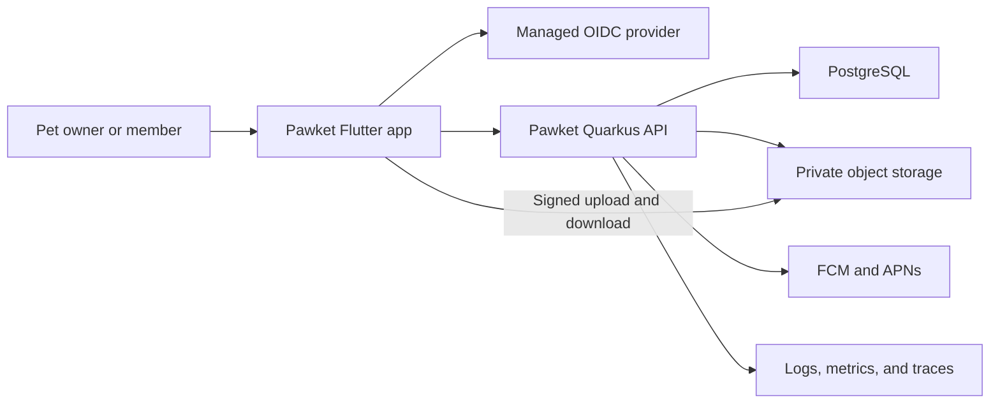

# System Architecture

## Context

Pawket is a mobile-first platform where users create long-lived pet profiles, switch between pets, publish media tagged to one or more pets, and share timelines with authorized people.

## Container responsibilities

### Flutter mobile application

- Owns presentation, navigation, local interaction state, media selection, upload coordination, and local caching.
- MUST treat the backend as the source of truth for shared domain data.
- MUST NOT make authorization decisions that the backend relies on.
- MAY optimistically update reversible interactions such as reactions.

### Quarkus backend

- Owns domain rules, authorization, membership, pet profiles, posts, timeline queries, invitations, media metadata, and audit history.
- Issues signed object-storage operations after authorization.
- Validates OIDC tokens and maps the external subject to an internal user.
- Publishes push notification requests and operational telemetry.

### PostgreSQL

- System of record for application and authorization data.
- Schema changes are controlled exclusively by versioned Flyway migrations.
- Application instances MUST NOT perform ad hoc schema mutation at runtime.

### Object storage

- Stores media bytes only; PostgreSQL stores identity, ownership, state, metadata, and storage keys.
- Buckets MUST be private.
- Object keys MUST be generated by the server and MUST NOT contain user-provided filenames or personal data.

### Identity provider

- Authenticates users and issues OIDC tokens.
- Does not own Pawket roles or pet membership authorization.
- Pawket MUST key users by issuer plus subject, not by email address.

## Trust boundaries

- The mobile device and all client input are untrusted.
- OIDC token validity establishes identity, not authorization to a pet or post.
- Signed storage URLs grant narrow, temporary access and MUST have minimal TTL and scope.
- Internal admin operations require separate authorization policy and audit logging.

## Primary runtime flows

### Create a pet

1. Mobile sends a validated create request with an idempotency key.
2. Backend resolves the authenticated internal user.
3. Pet module creates the pet and an active `OWNER` membership in one transaction.
4. Backend returns the pet representation and membership permissions.

### Publish a post with media

1. Mobile requests an upload intent with MIME type and size.
2. Backend validates limits and returns a signed URL plus media identifier.
3. Mobile uploads directly to object storage.
4. Mobile confirms the upload and submits the post with pet IDs.
5. Backend verifies media state and authorization for every tagged pet.
6. Backend creates post relationships atomically and schedules downstream processing.

### Read a timeline

1. Mobile requests a cursor-paginated timeline for one pet or all accessible pets.
2. Backend derives accessible pet IDs from active memberships.
3. Query returns authorized posts ordered by `captured_at`, then stable ID.
4. Backend creates short-lived media delivery URLs or returns delivery tokens.

## Availability and consistency

- Pet membership and authorization changes require strong database consistency.
- Post creation and pet tagging MUST be atomic.
- Reactions MAY use optimistic UI and eventual notification delivery.
- Push notifications are best effort and MUST NOT be the only record of an event.
- Object upload and post publication form a recoverable workflow, not a distributed transaction.

## Initial service objectives

These are engineering targets, not contractual SLAs:

| Signal | Initial target |
| --- | --- |
| API availability | 99.5% monthly |
| Read API p95 | under 500 ms, excluding media transfer |
| Write API p95 | under 800 ms, excluding media upload |
| Crash-free mobile sessions | at least 99.5% |
| Restore point objective | 24 hours maximum |
| Restore time objective | 4 hours maximum |

Targets MUST be revised using production evidence.

