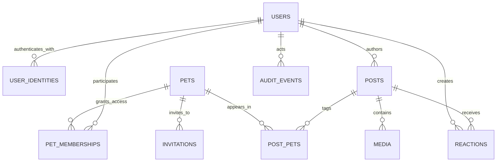

# Data Architecture

## Ownership model

Pawket separates identity from access:

- A `user` is an internal Pawket account linked to one or more external identities.
- A `pet` is a long-lived profile.
- A `pet_membership` grants a user a role on a pet.
- No pet is permanently embedded under a user record.

## Logical model



## Core tables

### users

- `id`
- `display_name`
- `avatar_media_id`, nullable
- `status`: `ACTIVE`, `SUSPENDED`, `DELETION_PENDING`, `DELETED`
- `created_at`, `updated_at`
- `version`

### user_identities

- `id`
- `user_id`
- `issuer`
- `subject`
- `email`, nullable and not used as identity key
- unique constraint on `(issuer, subject)`

### pets

- `id`
- `name`
- `species`: initially `DOG`, `CAT`
- `avatar_media_id`, nullable
- `birth_date`, nullable
- `estimated_birth`, boolean
- `gender`, nullable
- `breed`, nullable free text initially
- `adoption_date`, nullable
- `bio`, nullable
- `status`: `ACTIVE`, `ARCHIVED`, `DELETION_PENDING`, `DELETED`
- `created_at`, `updated_at`, `version`

Use either exact `birth_date` with an estimation flag or an explicitly designed precision model. Do not store both exact birth date and a drifting integer age.

### pet_memberships

- `id`
- `pet_id`
- `user_id`
- `role`: `OWNER`, `CARETAKER`, `FOLLOWER`
- `status`: `PENDING`, `ACTIVE`, `REMOVED`
- `created_at`, `joined_at`, `removed_at`
- unique active membership per `(pet_id, user_id)`

At least one active owner MUST exist for every active pet. This invariant is enforced in application logic and protected by transaction and locking strategy.

### posts

- `id`
- `author_id`
- `caption`, nullable
- `visibility`: `PRIVATE`, `PET_MEMBERS`, `FRIENDS` when supported
- `captured_at`
- `created_at`, `updated_at`
- `status`: `PUBLISHED`, `ARCHIVED`, `DELETED`
- `version`

### post_pets

- `post_id`
- `pet_id`
- composite unique constraint

A published post MUST tag at least one pet for the initial product unless an ADR changes the rule.

### media

- `id`
- `owner_user_id`
- `post_id`, nullable until publication
- `storage_key`
- `media_type`
- `mime_type`
- `byte_size`
- `width`, `height`, nullable until inspected
- `checksum`, nullable
- `status`: `PENDING_UPLOAD`, `UPLOADED`, `READY`, `REJECTED`, `DELETED`
- `created_at`, `uploaded_at`, `deleted_at`

### reactions

- `id`
- `post_id`
- `user_id`
- `type`
- `created_at`, `updated_at`
- unique constraint on `(post_id, user_id)` unless product permits multiple reactions

### invitations

- `id`
- `pet_id`
- `inviter_user_id`
- `requested_role`
- `token_hash`
- `expires_at`
- `accepted_by_user_id`, nullable
- `status`: `PENDING`, `ACCEPTED`, `REVOKED`, `EXPIRED`
- `created_at`, `accepted_at`

Raw invitation tokens MUST NOT be stored.

### audit_events

- `id`
- `actor_user_id`, nullable for system action
- `action`
- `resource_type`
- `resource_id`
- `metadata`, restricted JSON
- `correlation_id`
- `created_at`

Audit metadata MUST avoid secrets and unnecessary personal data.

## Schema conventions

- Table and column names use `snake_case` and plural table names.
- Primary and foreign keys MUST be explicit.
- Foreign-key delete behavior MUST be deliberate; default to `RESTRICT` for core records.
- All timestamps use UTC `timestamptz`.
- Every mutable aggregate has `updated_at`; concurrent aggregates SHOULD have a version column.
- Enumerations MUST be constrained by database check constraints or reference tables.
- Indexes MUST support measured query paths; every foreign key used for joins SHOULD be evaluated for an index.
- User-visible ordering MUST include a stable tiebreaker.

## Timeline ordering and pagination

Timelines order by:

```text
captured_at DESC, id DESC
```

Use opaque cursor pagination. Offset pagination MUST NOT be used for large or changing feeds because it produces duplicates and skips.

## Deletion and retention

- User-facing delete is soft delete first for recoverability and asynchronous cleanup.
- Authorization MUST hide soft-deleted records immediately.
- Physical deletion runs under a documented retention job.
- Shared media MUST not be deleted while referenced by a retained post.
- Account deletion MUST define treatment of posts shared with other pet members before implementation.
- Backup retention and object versioning MUST be documented in operations configuration.

## Migration policy

- Flyway migrations are immutable after merge to the shared branch.
- File names follow `V<version>__<description>.sql`.
- Destructive changes use expand-migrate-contract:
  1. Add compatible schema.
  2. Deploy code that reads and writes the compatible form.
  3. Backfill and verify.
  4. Stop old writes.
  5. Remove obsolete schema in a later release.
- Migrations MUST be tested against an empty database and a representative previous schema.
- Production rollback normally means forward-fix; down migrations are not assumed safe.

## Data access policy

- Application database credentials MUST have only required privileges.
- Humans MUST use audited, time-bound production access.
- Production data MUST NOT be copied to developer machines.
- Non-production datasets MUST be synthetic or irreversibly anonymized.

